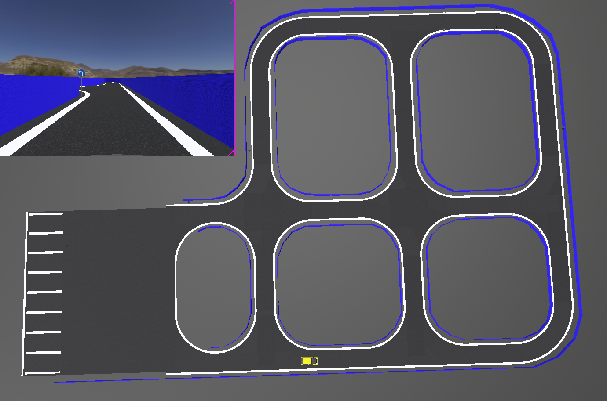
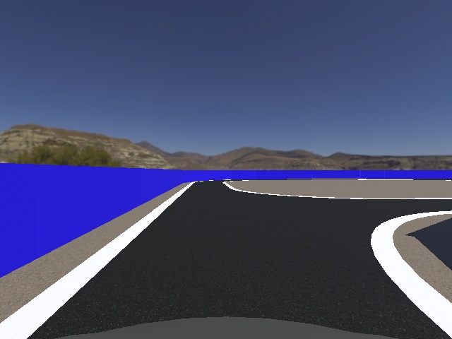
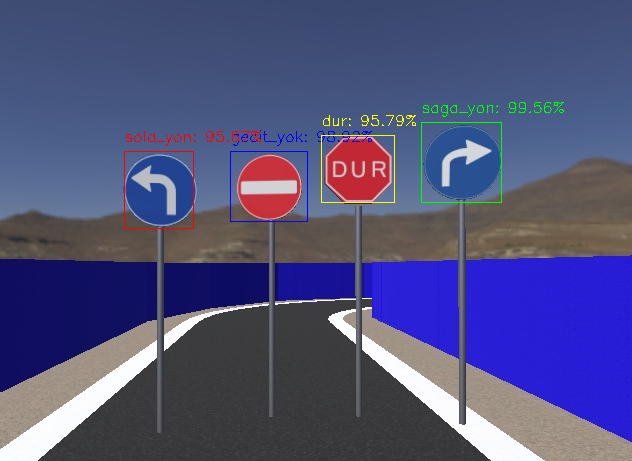

> # **Self Driving Car ( Teknofest Robotaksi )**
Teknofest Robotaksi yarışmasına ait haritayı başarılı şekilde tamamlayan otonom araç algoritması tasarlanıp simülasyon üzerinde test edilerek kodlanmıştır.
Araç üzerinde çalıştırılan algoritma haritayı doğru ve başarılı bir şekilde geçip son olarak park alanlarından uygun olan kısıma park edip görevlerini tamamlamıştır.
Aracımız üzerinde çalışan bir çok sistem bulunmaktadır. Bu sistemler aşağıda belirtilmiştir.
  - Şerit Takip Sistemi
  - Çevre Kontrol Sistemi
  - Trafik Levhaları Tanıma Sistemi
  - PID Kontrol Sistemi
  - Otonom Park Sistemi
  - Araç Yön Karar Sistemi

Tüm bu sistemleri ortak bir üst sistem tarafından kontrol edilerek araç üzerinde çalıştırılmıştır. Aracımız haritadaki şeritleri takip ederek yoluna devam etmektedir. Ayrıca
haritanın belirli yerlerine konumlandırılan trafik işaretlerine uygun şekilde yönlendirilmektedir. Trafik işaretleri ikiye ayrılarak tasarlanmıştır. Bu ayrım _direction signs_
ve _stop signs_ olarak belirlenmiştir. Direction Signs olarak belirlenen levhaların tamamı aracın doğru konuma yönlendirilmesini sağlarken, Stop Signs olarak belirlenen levhalar
araç için duruş/kalkış noktaları olarak kararlaştırılmıştır.

Tasarlanan ve kodlanan otonom sürüş algoritmaları [Webots](https://cyberbotics.com/) simülasyonu üzerinde çalıştırılarak test edilmiştir. Kullanılan simülasyon ortamına ait
harita tasarımı **map.wbt** dosyası olarak paylaşılmıştır. Haritanın genel kuş bakışı görüntüsü aşağıda gösterilmiştir.

  - Simülasyon Ortamı Tam Sürüm : [Webots R2021b](https://github.com/cyberbotics/webots/releases/tag/R2021b)

> ## Şerit Takip Sistemi
Araç üzerine konumlandırılan kameradan gelen görüntüyle gerçekleştirilmiştir. Anlık olarak kameradan gelen görüntü verisi üzerinden şeritler tespit edilerek takip sistemi
geliştirilmiştir. Görüntü verisi öncelikle perspektif çarpıtma yöntemiyle kuş bakışı hale getirilmiştir. Kuş bakışı hale getirilen görüntü verisi bir sonraki aşama olan görüntü
eşikleme yöntemiyle _(thresholding)_, ikili _(binary)_ görüntüye çevrilmiştir. Bu yöntem sayesinde şeritler belirginleştirilmiş ve tespit edilmiştir. Tespiti gerçekleştirilen
şeritlerle araç kamerasının orta noktasına olan uzaklığını hata değeri olarak bulunmasını sağlamıştır. Bu hata değeri araca yön verilmesi için PID kontrol sistemine gönderilerek
şeritlere göre aracın yol üzerinde hareketini sağlamıştır.

> ## Çevre Kontrol Sistemi
Aracın şerit takip sistemiyle hareketi sağlanırken oluşabilecek olumsuz durumları ortadan kaldırmak için geliştirilmiştir. Bazı beklenmeyen durumlarda araç kamerasındaki görüntüde
şeritlerin kaybolması durumunda doğru şekilde aracı yönlendirmek amaçlanmıştır. Bu geliştirilen algoritmada hangi ( sağ ve sol ) şeride göre araç yönlendirilmesi yapılıyorsa,
anlık olarak şeridin kaybolması durumunda araç ilgili yöne belirlenen açı ile yönlendirilerek ilgili şeridi tekrar bulması sağlanmıştır. Aynı zamanda şerit takibinin devre dışı kaldığı
durumlarda aracın yol dışına çıkarak çevre engellere çarpması engellenmiştir.

> ## Trafik Levhaları Tanıma Sistemi
Hazırlanan harita üzerinde aracın doğru şekilde görevlerini tamamlayabilmesi ve trafik kurallarına uygun hareket edebilmesi için levha tanıma sistemi geliştirilmiştir.
Levhaların tanınması için **[YOLOV4](https://github.com/AlexeyAB/darknet)** nesne tanıma algoritması kullanılmıştır. Haritada kullanılacak olan trafik levhalarına ait bir çok görsel etiketlenerek
**[YOLOV4](https://github.com/AlexeyAB/darknet)** algoritmasıyla eğitimi gerçekleştirilmiştir. 
Eğitim sonucunda çıkan ağırlık dosyası kaydedilerek kameradan anlık olarak gelen görüntü üzerinde kullanılarak trafik levhalarının tanınması sağlanmıştır.
Eğitim bulut sisteminde **[Google Colab Notebook](https://colab.research.google.com/drive/1_GdoqCJWXsChrOiY8sZMr_zbr_fH-0Fg?usp=sharing)** üzerinden tamamlanmıştır.
- dur, durak, gecit_yok, ileri_saga, ileri_sola, kirmizi_isik, park, park_yasak, 
- saga_donus_yok, saga_yon, sola_donus_yok, sola_yon, yesil_isik

> ## PID Kontrol Sistemi
Aracımız hareketini şerit takip sistemine göre gerçekleştirmektedir. Şerit takip sisteminde de anlatıldığı gibi, kameradan gelen görüntü verisine göre bir hata değeri hesaplanmaktadır. Bu hata değerini en aza indirecek şekilde araç yönlendirilmesi yapılmaktadır. Araç yönlendirilmesi **[PID](https://tr.wikipedia.org/wiki/PID)** kontrol döngü yöntemiyle yapılmaktadır. Bir PID denetleyicisi sürekli olarak bir hata değerini, yani amaçlanan sistem durumu ile mevcut sistem durumu arasındaki farkı hesaplamaktadır. Denetleyici süreç kontrol girdisini ayarlayarak hatayı en aza indirmeye çalışmaktadır. Bu durumlara uygun ürettiği çıkış değerini aracın yön açı değerine eşitlenmesiyle otonom sürüş sistemi sağlanmıştır. PID kontrol sistemleri üç ayrı sabit parametreye ihtiyaç duymaktadır. Bu değerler **| Kp, Kd, Ki |** olmak üzere, aracımıza uygun şekilde belirlenmiştir.

